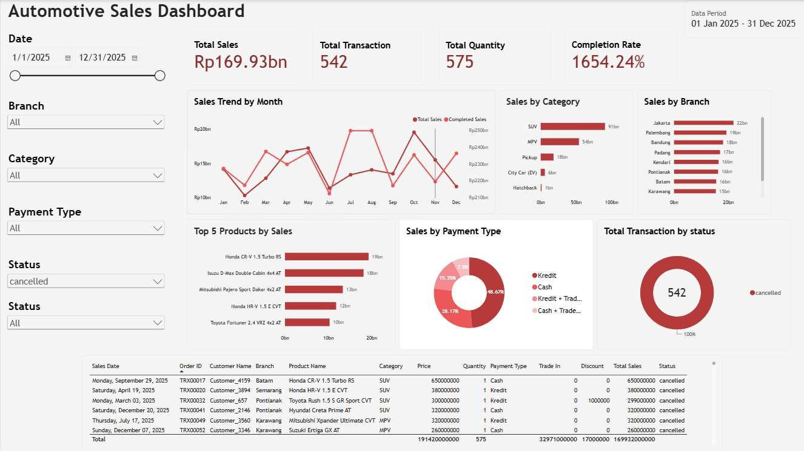

# Car Sales Power BI Practice

## About

A mini project created to practice Power BI for data analysis and interactive dashboard development using car sales transaction data.

## Dashboard Preview

## Dataset

The dataset contains car sales transaction data, including sales date, branch, product, category, price, quantity, payment type, discount, total sales, and other related fields.

## Analysis Objectives

1. Analyze car sales performance based on the available transaction data.
2. Create interactive visualizations to explore sales trends and patterns.
3. Compare sales performance across different categories and branches.
4. Develop an interactive dashboard with filters and date selection.
5. Present key insights from the analysis through a management-oriented dashboard.

## Power BI Concepts

- Data preparation
- Data modeling
- DAX
- Date table
- Measures
- Slicers and filters
- Data visualization
- Interactive dashboard
- Sales analysis

## Documentation

The PDF contains the analysis objectives, Power BI dashboard, and the corresponding analysis results. The content and explanations are written in Indonesian.

## Tools

- Microsoft Power BI
- Power Query
- DAX
